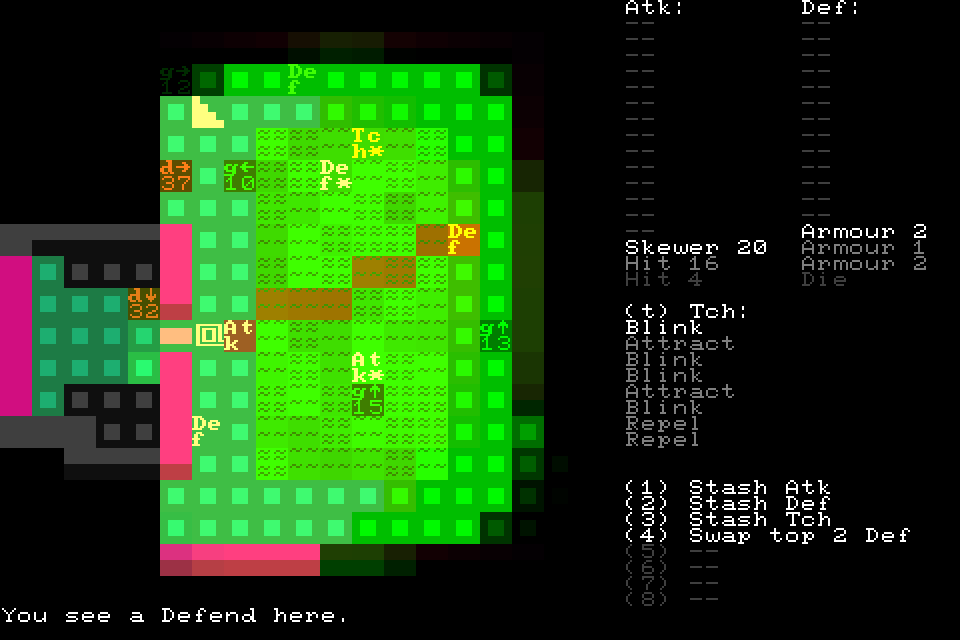
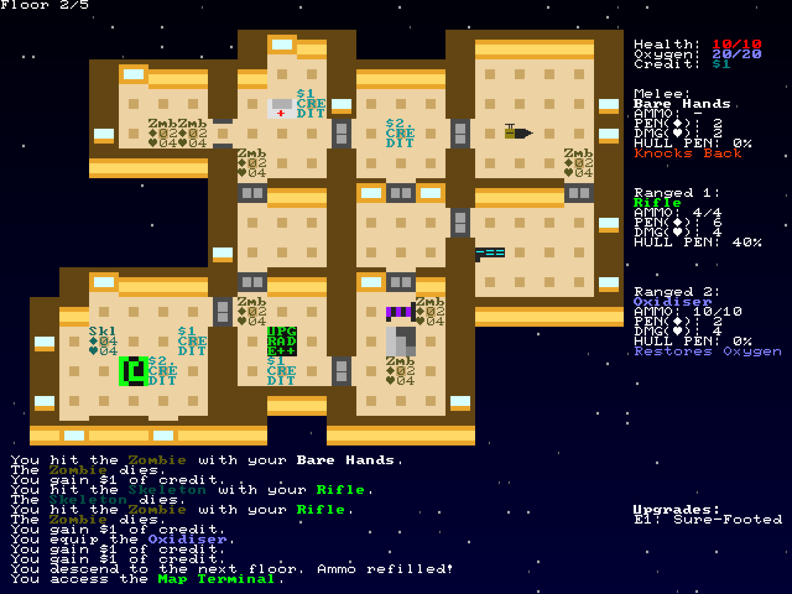
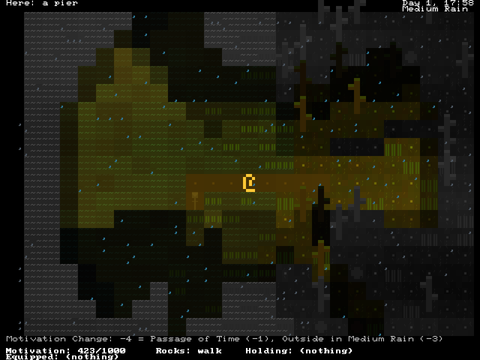
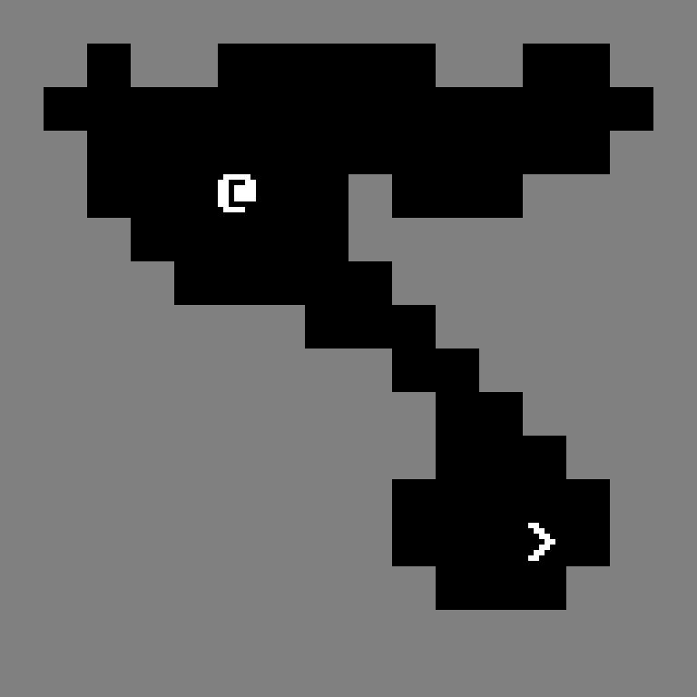
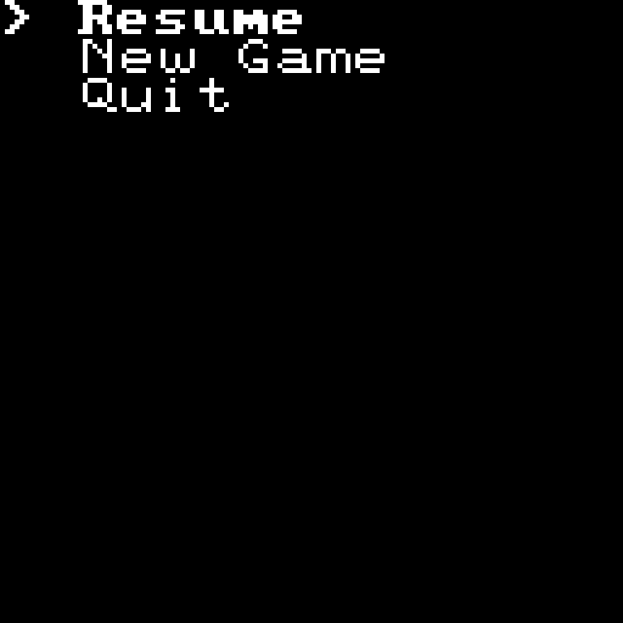
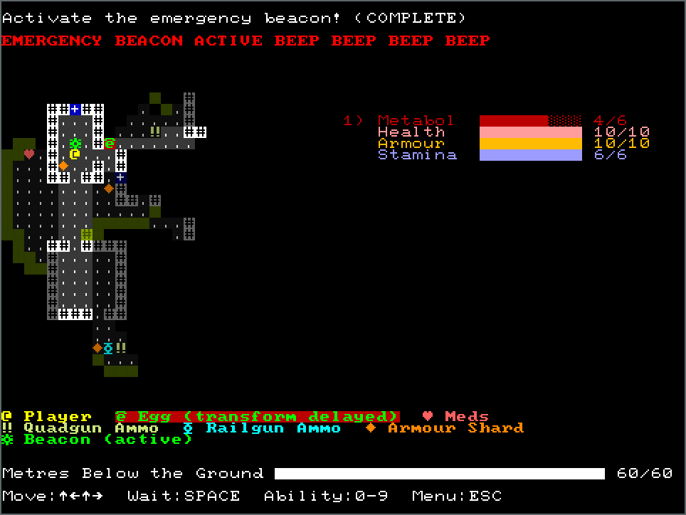

# **Escaping State-Machine Hell with a Pseudo-Synchronous DSL**

## Sydney Rust Meetup 2022-10-10

#### by Stephen Sherratt (@gridbugs)

stephen@sherra.tt
github.com/gridbugs
twitch.tv/gridbugs
gridbugs.itch.io
gridbugs.org
twitter.com/gridbugstv

---

# Chargrid



Crates for building cross-platform text-UIs

```rust
use chargrid;
```

Supports
 - Graphical Windows
 - ANSI Terminals
 - Web Browsers

 Lowest common denominator control flow:
  - **Tick-based applications only!**

---

# Point of this talk



It's tedious to program in a tick-based environment. Here's an EDSL that can help!

---

# Chargrid Components

```rust
pub trait Component {

    /// type of yielded values
    type Output;

    /// render to frame buffer
    fn render(&self, fb: &mut FrameBuffer);

    /// process events and yield values
    fn update(&mut self, event: Event) -> Self::Output;
}

```

---

# Little Example Game

 

---

# Game Component


```rust
enum GameOutput {
    GameOver,
    EscapeWasPressed,
}

impl Component for Game {

    type Output = Option<GameOutput>;

    fn render(&self, fb: FrameBuffer) {
        // render the current frame
    }

    fn update(&mut self, event: Event) -> Self::Output {
        // pass the event to the game engine
    }
}
```
---

# Menu Component


```rust
enum MenuSelection {
    Resume,
    NewGame,
    Quit,
}

impl Component for Menu {

    type Output = Option<MenuSelection>;

    fn render(&self, fb: FrameBuffer) {
        // render the menu
    }

    fn update(&mut self, event: Event) -> Self::Output {
        // update the menu state, returning `Some(...)`
        // if a selection was finalized
    }
}
```

---

# App Component

 

```rust
enum App {
    Game(Game),
    Menu(Menu),
}

impl Component for App {
    type Output = ();

    fn render(&self, fb: FrameBuffer) {
        match self {
            Self::Game(game) => game.render(fb),
            Self::Menu(menu) => menu.render(fb),
        }
    }

    fn update(&mut self, event: Event) -> Self::Output {
        match self {
            Self::Game(game) => game.update(event),
            Self::Menu(menu) => menu.update(event),
        };
    }
}

```

---

# The Dream

```rust
let mut game = Game::new();

loop {

    match game.run() {
        GameOver => break,
        EscapeWasPressed => (),
    }

    match Menu::new().run() {
        Resume => (),
        NewGame => game = Game::new(),
        Quit => break,
    }
}
```

---

# With Chargrid `control_flow` API

```rust
loop_(Game::new(), |game| {
    cf(game).and_then(|game_output| match game_output {
        GameOver => LoopControl::Break(()),
        EcapeWasPressed => cf(Menu::new()).map(|selection| match selection {
            Resume => LoopControl::Continue(()),
            NewGame => {
                *game = Game::new();
                LoopControl::Continue(())
            }
            Quit => LoopControl::Break(()),
        })
    })
})
```

---

# Peeking Inside

```rust
struct CF<C: Component>(C);

fn cf<C: Component>(c: C) -> CF<C> { CF(c) }

impl<C: Component> Component for CF<C> { ... }

impl<T, C: Component<Output = Option<T>>> {
    fn and_then<U, C2: Component<Output = U>, F: FnOnce(T) -> C2>(self, f: F)
    -> CF<AndThen<C, C2, F>
    {
        ...
    }

    ...
}

enum AndThen<C1, C2, F> { ... }
impl<C1, C2, F> Component for AndThen<C1, C2, F> { ... }
...
```

---



# More Chargrid

My github: https://github.com/gridbugs

My gamedev blog: https://gridbugs.org

Occasional programming livestreams: https://twitch.tv/gridbugs

Some games made with chargrid: https://gridbugs.itch.io

Minimal re-implementation for demo purposes: https://github.com/gridbugs/chargrid-talk

Chargrid roguelike tutorial: https://gridbugs.org/roguelike-tutorial-2020/
